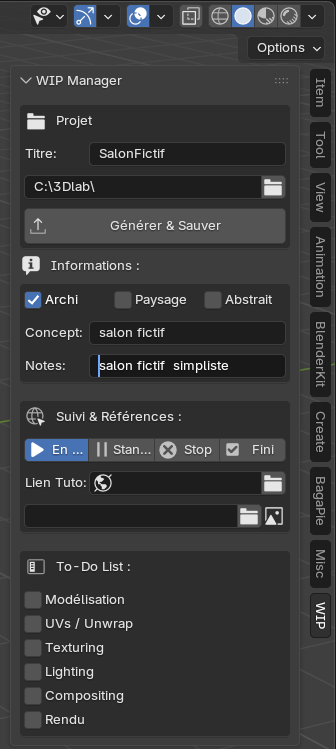
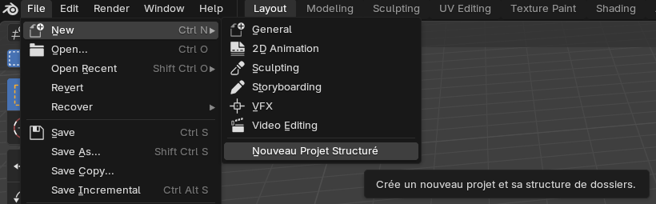
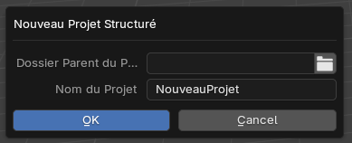
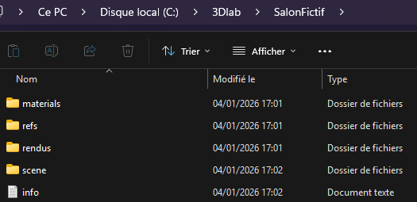

# WIP Manager Ultimate (v3.5) / Project Creator (v2.5)

## 🚧 Gestion de Projet 3D pour Blender

Le **WIP Manager Ultimate** est un add-on pour Blender conçu pour rationaliser le début et le suivi de vos WIP 3D. Fini les fichiers `.blend` éparpillés et les dossiers manuels ! Cet outil vous permet de générer instantanément une structure de projet complète et de suivre votre progression directement dans l'interface de Blender.

---

## 🚀 Fonctionnalités Clés

Cet add-on se trouve dans la **Sidebar (panneau N)** de la vue 3D, sous l'onglet **WIP**.

### 1. Démarrage Automatisé (`Générer & Sauver`)

La fonction principale s'occupe de la logistique du projet :
* **Génération de la Structure :** Crée un dossier racine pour votre projet, contenant les sous-dossiers essentiels : `scene`, `materials`, `refs`, et `rendus`.
* **Sauvegarde Intelligente :** Sauvegarde automatiquement votre fichier `.blend` ouvert sous un nom propre (`Titre_v001.blend`) directement dans le sous-dossier `/scene/`.
* **Documentation du Projet :** Crée un fichier texte (`info.txt`) à la racine du projet, récapitulant le titre, le concept, la description et les liens de référence saisis.

### 2. Informations et Suivi

Le panneau vous permet de documenter votre travail pour un suivi efficace :
* **Classification :** Cochez le type de projet (Architecture, Paysage, Abstrait).
* **Concept & Notes :** Saisissez un pitch rapide et des notes détaillées sur vos intentions.
* **Statut du Projet :** Suivez l'état du WIP avec des boutons clairs (En cours, Standby, Stop, Fini).
* **Références :** Enregistrez les liens vers des tutoriels ou des ressources, et le chemin vers une image de référence pour un accès rapide.

### 3. To-Do List Intégrée

Ne perdez jamais le fil de votre travail avec la To-Do List persistante (les cases restent cochées après la sauvegarde de votre fichier Blender) :
* Modélisation
* UVs / Unwrap
* Texturing
* Lighting
* Rendu

---

## 🛠️ Installation

1.  Téléchargez le fichier `wip_manager.py` ou `project_creator.py`
2.  Dans Blender, allez dans `Edit > Preferences > Add-ons`.
3.  Cliquez sur `Install from disk...` et sélectionnez le fichier `wip_manager.py` ou `project_creator.py`.
4.  Cochez la case pour activer l'add-on **"WIP Manager Ultimate"** ou **"Project Creator"**.
5.  pour le plugin **"WIP Manager Ultimate"**, le panneau apparaît dans la **Sidebar (N)**, sous l'onglet **WIP**.
6. Pour le plugin **"Project Creator"** il faut cliquer sur File > new > Nouveau projet structuré

7. /!\  ATTENTION : pour le plugin **"WIP Manager Ultimate"** il faut cliquer sur le bouton "Générer & Sauver" APRES avoir renseigner tous les champs (Informations, Suivi & références, status...)  /!\

---

## 📸 Aperçu

| WIP Manager Ultimate |
| :------------------: |
|  |

---

## 📸 Aperçu

| Project Creator |
| :------------------: |
|  |
|  |
|  |

---

## 📸 Aperçu

| Pour les 2 plugins, voici l'arborecence générée |
| :------------------: |
|  |

---

## 🐛 Remarques Techniques

* **Version Blender Recommandée :** 4.0 <> 5.0
* Les scripts utilisent des icônes standard pour assurer la compatibilité sur différentes versions.

---

## 💖 Contribution

N'hésitez pas à me proposer des améliorations, des corrections de bugs ou des idées de nouvelles fonctionnalités via les Issues ou les Pull Requests !